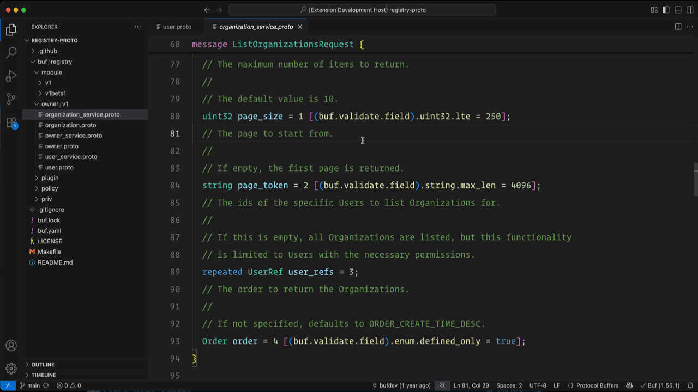

# Buf for Visual Studio Code

The [VS Code Buf extension][vs-code-marketplace] provides rich support for [Protocol Buffers][protobuf] using the [Buf][buf] development environment.

## Features

- **Code navigation** - Go-to definition and documentation insets for `.proto` symbols.
- **Syntax highlighting** - Protobuf specific color and styling of code.
- **Code editing** - Formatting via `buf format` and annotations based on `buf lint` and `buf breaking`.
- **Buf command support** - Execution of `buf` CLI commands via the [Command Palette][command-palette].

## Getting Started

[Install the latest version via the VS Code marketplace][vs-code-marketplace].

By default, the extension will use your locally-installed version of `buf` on your system
`$PATH`. However, you are not required to have `buf` installed, the extension can manage and
install it for you based on the [buf.commandLine.path](#buf.commandline.path) and [buf.commandLine.version](#buf.commandline.version)
configurations:

| | <pre>buf.commandLine.path</pre> | <pre>buf.commandLine.version</pre> |
| --- | --- | --- |
| Default: Use `buf` from the system `$PATH`. | {empty} | {empty} |
| Use the latest released version of `buf` and check for updates on extension activation. | {empty} | `latest` |
| Use `buf` at specified path. | User specified path | {empty} |
| Install and use the specified version of `buf`. | {empty} | User specified semver version |
| Use `buf` at specified path and display an error message. | User specified path | User specified semver version |

## Extension Settings

This extension contributes the following configuration settings.

### buf.commandLine.path

Default: `null`
The path to a specific install of Buf to use. Relative paths are supported and are relative to the workspace root.

### buf.commandLine.version

Default: `null`
Specific version (e.g. 'v1.53.0') of Buf release to download and install.

### buf.restartAfterCrash

Default: `true`
Automatically restart the Buf Language Server (up to 4 times) if it crashes.

### buf.enableHover

Default: `true`
Enable hover features provided by the language server.

### buf.enable

Default: `true`
Enable Buf Language Server features.

### buf.debug

Default: `false`
Enable debug logs in output channels.

### buf.log-format

Default: `text`
Buf Language Server log format.

### buf.checks.breaking.againstStrategy

Default: `git`
The strategy to use when checking breaking changes against a specific reference.

### buf.checks.breaking.againstGitRef

Default: `refs/remotes/origin/HEAD`
The Git reference to check breaking changes against. This is only compatible when `buf.checks.breaking.againstStrategy`
is set to `git`, otherwise it is ignored.

## Commands

This extension contributes the following commands to the [Command Palette][command-palette].

### Setup

- Install CLI: installs the `buf` CLI based on `buf.commandLine.path` and `buf.commandLine.version`
  configurations and then attempts to start the language server.
- Update CLI: updates the `buf` CLI based on `buf.commandLine.path` and `buf.commandLine.version`
  configurations and then attempts to start the language server.

### Language Server

- Start Buf Language Server: starts the Buf Language Server. If the Buf Language Server is
  already running, it will stop and then start it.
- Stop Buf Language Server: stops the Buf Language Server. If the Buf Language Server is not
  currently running, then it is a no-op.

### Buf

- Generate: runs `buf generate` at the root of each workspace.

### Extension

- Show Buf Output: shows the extension output channel

## Legal

Offered under the [Apache 2 license][license].

[command-palette]: https://code.visualstudio.com/docs/getstarted/userinterface#_command-palette
[vs-code-marketplace]: https://marketplace.visualstudio.com/items?itemName=bufbuild.vscode-buf
[protobuf]: https://protobuf.dev/
[buf]: https://buf.build/
[license]: https://github.com/bufbuild/vscode-buf/blob/main/LICENSE
