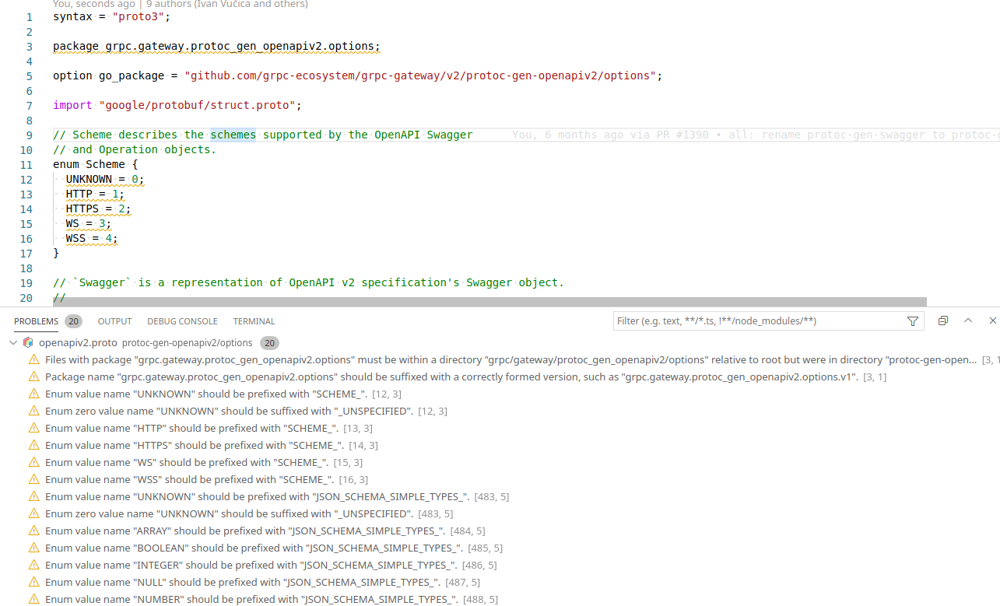

# Buf for Visual Studio Code

## Installation

Install via the Visual Studio Code extension browser or see
[the extension page](https://marketplace.visualstudio.com/items?itemName=bufbuild.vscode-buf)
for detailed installation instructions.

## Features

Currently only supports linting but expect new features to be added soon!

- Lints your protobuf files using `buf lint`. It checks your currently opened file
  whenever you save it.

  

## Requirements

- [buf](https://docs.buf.build/installation)

## Extension Settings

This extension contributes the following settings:

- `buf.binaryPath`: configure the path to your buf binary. By default it uses `buf` in your `$PATH`.

## Changelog

- v0.5.0
  - Add formatting through using buf format. Defaults to format on save.
- v0.4.0
  - Use single file reference to resolve lint file from any path
- v0.3.1
  - Accept v1.0.0-rc1 in version parser
- v0.3.0
  - Change `--version` to read from both `stdout` and `stderr`
- v0.2.0
  - Update minimum required version to v0.34.0
- v0.1.3
  - Update logo
- v0.1.0
  - Add version check and download link
- v0.0.3
  - Fix missing generation command
